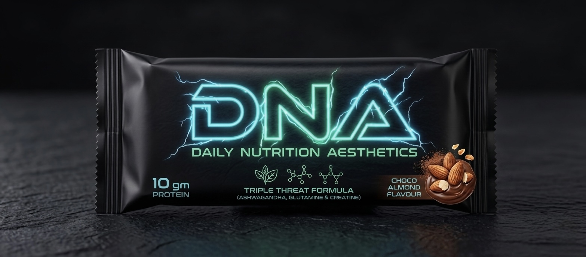

Tabs 
1. Home: high-impact landing page. It should instantly feature a cinematic hero banner of our tagline 

And as we scroll down the slide changes into our logo DNA  (DAILY NUTRITION AESTHETICS), and a massive "Shop Now" call-to-action (CTA)
2. Shop / Our Bars: The most important tab. Clicking this should open a clean product collection grid featuring our launch lineup: Choco Almond, Blueberry Butterscotch, or Biscotti Blueberry (anyone of the blueberry flavour will be kept still not finalised) 
3. ⁠Our Philosophy: This replaces a boring "About Us" tab. Since your brand promise is built on unfiltered transparency, this page should break down the why behind DNA—focusing on clean labels, cold-pressed processing, zero waxy binders, and real food ingredients.
4. ⁠DNA Community: A dedicated space for : 
• The School & College Hustle (Gen-Z Hub): Targeted at school and college students. This section highlights quick energy between lectures, fueling up before sports practice, or a healthy late-night study snack that replaces junk food.
• The Corporate & Daily Grind (Millennials & Professionals): Targeted at working professionals who need a clean, desk-friendly snack to avoid the 4 PM office biscuit trap.
• The Active Masters (Parents & Seniors): Highlighting older age groups who use it for clean, easily digestible morning-walk energy or managing daily nutrition effortlessly.
So as of now we would put ai generated realistic videos or clips for people to connect what our brand does

5. User Account (Profile Icon): For customers to log in, track their subscription boxes, check past orders, and manage shipping addresses.
 6. Cart (Shopping Bag/Cart Icon): A slide-out "mini-cart" feature so users can see what they've added to their order without being forced to leave the page they are browsing.

 7. Footer Navigation Links (Bottom of the Website)
Keep these out of the top menu to avoid cluttering your clean aesthetic. Put them in the website's footer:
 Support / Contact Us: Customer care email, factory/business location, and a contact form.
 FAQs: Crucial for food brands. This is where you answer questions like: "What is the shelf life?", "Does it contain whey protein?", "How does it survive summer transit?"
 Shipping & Returns Policy: Explaining delivery timelines across India and your refund policies.
 Legal: Terms of Service and Privacy Policy (mandatory for payment gateway setups).

 Color theme : black and cyan blue for over all website

 Contact details we would have a company number seperate as of now it can be xyz 
And emai id will be created from go daddy for the brand
Product specification: 
There are two category of products 
1. DNA CREATINE  BAR 
2. ⁠DNA COLLAGEN BAR

Product soecification is not available with us as it is still under testing phase

These are the two product image